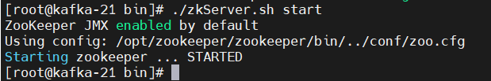

## 消息队列

常见的消息队列，如下：
  1. rabbitmq 
  2. rocketmq
  3. kafka
  4. pulsar

----

### rabbitmq

### rocketmq

### kafka
    
  官方网址： https://kafka.apache.org/

  集群搭建：

  kafka 在 v2.8.0 后将zookeeper替换掉，使用独立的集群管理工具。
  目前搭建采用： zookeeper + kafka 进行搭建

  准备工作：

  系统： Centos7 jdk1.8

  ip: 192.168.35.21 - 23

  命名主机：hostnamectl set-hostname kafka-[21,22,23]

  zookeeper 搭建：
  
  搭建目录 /opt/zookeeper   /opt/kafka

  zookeeper目录结构：
  
  1. bin: 运行命令
  2. conf: 配置文件
  3. datas: 自己创建的数据文件夹
  4. docs: 文档
  5. lib: zookeeper的jar文件
  6. logs: 日志文件
  
  进入conf文件夹，复制zoo_sample.cfg为zoo.cfg，并编辑zoo.cfg文件如下。

    dataDir=/opt/zookeeper/zookeeper/datas
    server.1=192.168.35.21:2888:3888
    server.2=192.168.35.22:2888:3888
    server.3=192.168.35.23:2888:3888
    dataDir 需要修改对应的数据存储目录，目前是临时文件目录，需要进行修改
    其中2888是服务端口，3888是选举端口
    三台机器都要进行相应的配置

  
  
  在zookeeper根目录下创建datas目录。

    mkdir datas
  
  在此datas下创建 myid 文件，并追加对应的编号
  
    echo 1 > datas/myid    192.168.35.21
    echo 2 > datas/myid    192.168.35.22
    echo 3 > datas/myid    192.168.35.23

  
  
  启动zookeeper
  
  进入zookeeper的bin目录下，三台机器均执行如下命令：
  
    ./zkServer.sh start

  

  启动完成
  
  查看zookeeper状态：
  
  
    

  搭建kafka

### pulsar

    