## 消息队列

常见的消息队列，如下：

1. rabbitmq
2. rocketmq
3. kafka
4. pulsar

----

### rabbitmq

### rocketmq

### kafka

官方网址： https://kafka.apache.org/

集群搭建：

kafka 在 v2.8.0 后将zookeeper替换掉，使用独立的集群管理工具。 目前搭建采用： zookeeper + kafka 进行搭建

#### 准备工作：

系统： Centos7 jdk1.8

ip: 192.168.35.21 - 23

命名主机：hostnamectl set-hostname kafka-[21,22,23]

#### zookeeper 搭建：

搭建目录 /opt/zookeeper /opt/kafka

zookeeper目录结构：

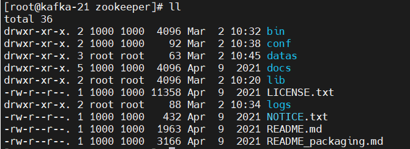

1. bin: 运行命令
2. conf: 配置文件
3. datas: 自己创建的数据文件夹
4. docs: 文档
5. lib: zookeeper的jar文件
6. logs: 日志文件

进入conf文件夹，复制zoo_sample.cfg为zoo.cfg，并编辑zoo.cfg文件如下。

    dataDir=/opt/zookeeper/zookeeper/datas
    server.1=192.168.35.21:2888:3888
    server.2=192.168.35.22:2888:3888
    server.3=192.168.35.23:2888:3888
    dataDir 需要修改对应的数据存储目录，目前是临时文件目录，需要进行修改
    其中2888是服务端口，3888是选举端口
    三台机器都要进行相应的配置

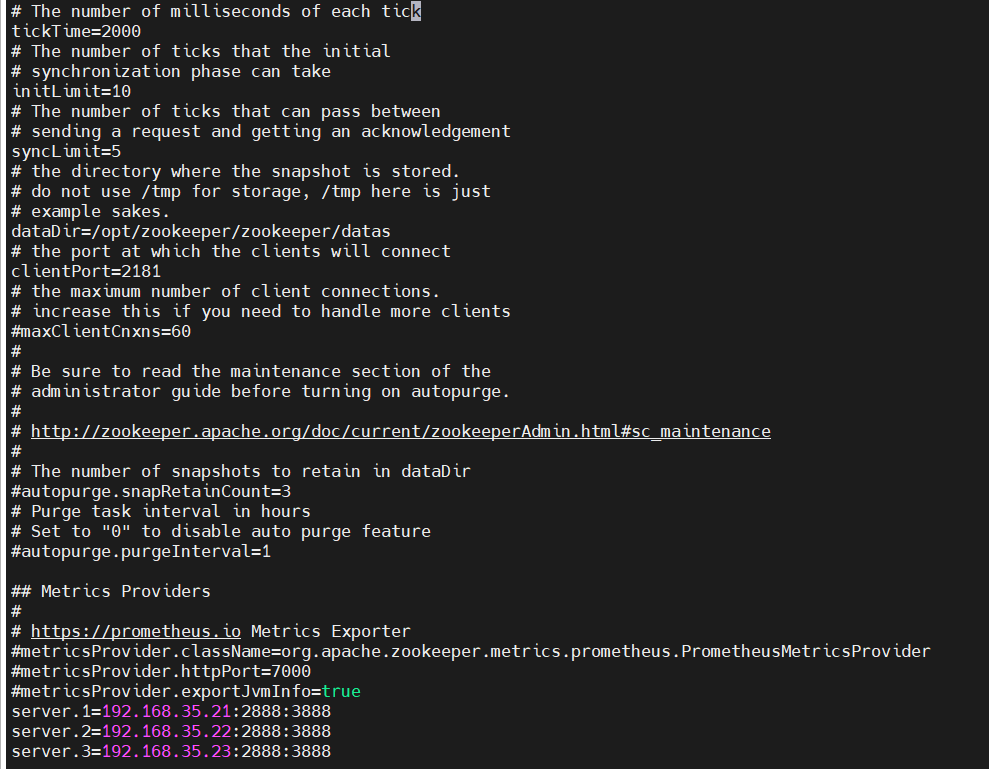

在zookeeper根目录下创建datas目录。

    mkdir datas

在此datas下创建 myid 文件，并追加对应的编号

    echo 1 > datas/myid    192.168.35.21
    echo 2 > datas/myid    192.168.35.22
    echo 3 > datas/myid    192.168.35.23

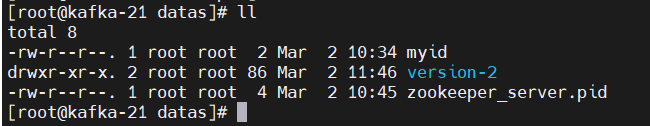

启动zookeeper

进入zookeeper的bin目录下，三台机器均执行如下命令：

    ./zkServer.sh start


启动完成

查看zookeeper状态：

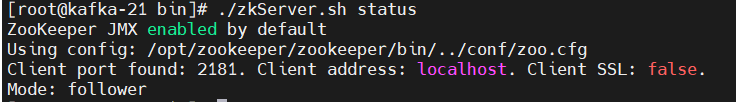

#### 搭建kafka

kafka目录结构


1. bin 启动目录
2. config 配置文件
3. libs kafka的三方jar文件
4. logs kafka日志文件

kafka配置文件，conf/server.properties

    broker.id=1
    zookeeper.connect=192.168.35.21:2181,192.168.35.22:2181,192.168.35.23:2181/kafka
    log.dirs=/opt/kafka/kafka/logs
    broker.id=1 每台服务器不一样  【21 为 1  22 为2  23 为3】
    zookeeper.connect zookeeper的链接地址
    log.dirs 日志文件存储位置

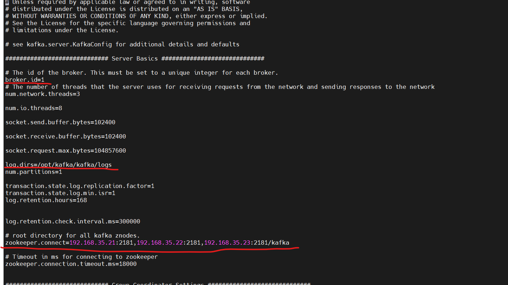

启动zookeeper

    启动命令如下：
    ./kafka-server-start.sh -daemon ../config/server.properties

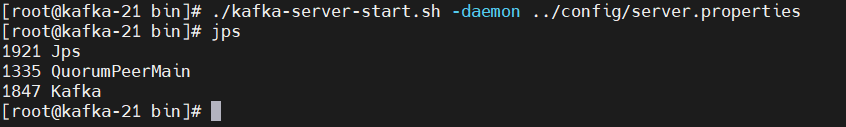

查看kafka中的topic

    kafka-topics.sh --bootstrap-server 127.0.0.1:9092 --list

---

#### kafka 原生代码

   ```xml

<dependency>
    <groupId>org.apache.kafka</groupId>
    <artifactId>kafka-clients</artifactId>
    <version>${kafka-version}</version>
</dependency>
   ```

  ```java
    // 异步发送
@Slf4j
public class KafkaProducerTest {

    @Test
    public void testKafkaProducer_1() {
        Map<String, Object> configs = new HashMap<>();
        // 链接kafka集群
        configs.put(ProducerConfig.BOOTSTRAP_SERVERS_CONFIG, "192.168.35.21:9092, 192.168.35.22:9092");
        // 配置key的序列化
        configs.put(ProducerConfig.KEY_SERIALIZER_CLASS_CONFIG, StringSerializer.class.getName());
        // 配置value的序列化
        configs.put(ProducerConfig.VALUE_SERIALIZER_CLASS_CONFIG, StringSerializer.class.getName());
        // 创建一个kafka对象
        KafkaProducer<String, String> producer = new KafkaProducer<>(configs);
        // String topic 发送的topic， Integer partition 发送的分区，
        // Long timestamp 发送的时间戳， Object key Object value
        ProducerRecord<String, String> record = new ProducerRecord<>("test-topic", "first-value");
        // 发送数据   record 是消息体，  Callback callback  回调函数
        // producer.send(record);
        producer.send(record, (metadata, exception) -> {
            if (exception == null) {
                log.info("发送完成");
                log.info("数据信息：话题：{}, 分区：{}", metadata.topic(), metadata.partition());
            }
        });
        // 关闭资源
        producer.close();
    }

    // 同步发送
    @Test
    public void testKafkaProducer_sync() throws ExecutionException, InterruptedException {
        Map<String, Object> configs = new HashMap<>();
        // 链接kafka集群
        configs.put(ProducerConfig.BOOTSTRAP_SERVERS_CONFIG, "192.168.35.21:9092, 192.168.35.22:9092");
        // 配置key的序列化
        configs.put(ProducerConfig.KEY_SERIALIZER_CLASS_CONFIG, StringSerializer.class.getName());
        // 配置value的序列化
        configs.put(ProducerConfig.VALUE_SERIALIZER_CLASS_CONFIG, StringSerializer.class.getName());
        // 创建一个kafka对象
        KafkaProducer<String, String> producer = new KafkaProducer<>(configs);
        // String topic 发送的topic， Integer partition 发送的分区，
        // Long timestamp 发送的时间戳， Object key Object value
        ProducerRecord<String, String> record = new ProducerRecord<>("test-topic", "first-value");
        // 发送数据   record 是消息体，  Callback callback  回调函数
        // producer.send(record);
        producer.send(record, (metadata, exception) -> {
            if (exception == null) {
                log.info("发送完成");
                log.info("数据信息：话题：{}, 分区：{}", metadata.topic(), metadata.partition());
            }
            // 多了个get
        }).get();
        // 关闭资源
        producer.close();
    }
}
  ```

kafka 代码整合 springboot

#### kafka 原理图

kafka的broker、topic及partition


生产者发送数据流程：
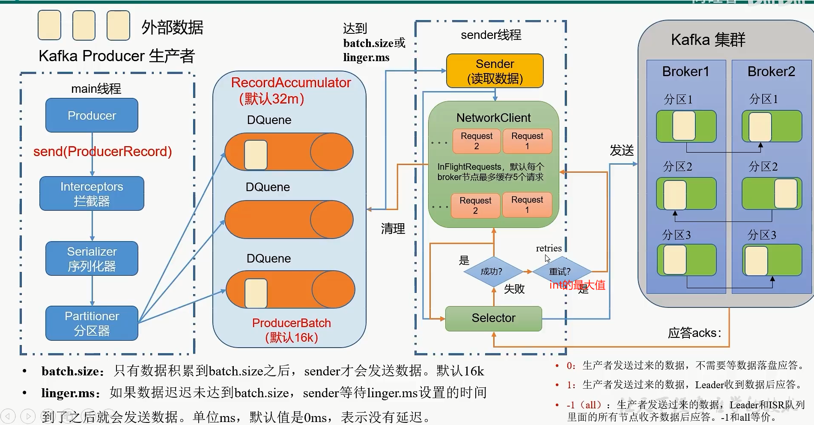

#### kafka分区原理：

kafka默认分区规则： DefaultPartition类完成

1. 指定了分区，那么按着指定的分区进行分
2. 没有指定分区，按key的hash取模进行分区
3. 既没有指定分区且没有指定key，那么按照黏性进行分区，即：batch满了后，分到一个区

分区重构函数：

修改分区命令：

  ```shell
    # 只能增，不能减小
    kafka-topics.sh --bootstrap-server 127.0.0.1:9092 --topic test-topic --alter --partitions 2
    kafka-topics.sh --bootstrap-server 127.0.0.1:9092 --describe --topic test-topic
  ```

  ```java
    // 指定了 partition分区 
public ProducerRecord(String topic,Integer partition,K key,V value,Iterable<Header> headers){}
// 未指定分区
// 根据Key的hash和topic的partition数取模获取到partition的值
public ProducerRecord(String topic,K key,V value){}
// 黏性分区，随机选一个分区，然后 batch.size的大小或linger.ms时间到了，那么刷新此分区，等再次有消息时，再次随机选择一个partition分区
public ProducerRecord(String topic,V value){}
  ```  

自定义分区

  ```java

// 实现Partitioner接口，并且实现partition，当党报future的key时，分区到 0 ，否则分区到1
// 如果分区的区不存在，那么消息会一直尝试发送
@Slf4j
public class KafkaCustomPartition implements Partitioner {

    @Override
    public int partition(String topic, Object key, byte[] keyBytes, Object value, byte[] valueBytes, Cluster cluster) {
        if (Objects.isNull(key)) {
            throw new NullPointerException("key不能为空");
        }
        // 将分区分成   【0： 包含 future， 1：不包含future】
        if (StringUtils.contains(key.toString(), "future")) {
            return 0;
        }
        return 1;
    }

    @Override
    public void close() {

    }

    @Override
    public void configure(Map<String, ?> configs) {

    }

    @Test
    public void testKafkaPartitionProducer_sync() throws ExecutionException, InterruptedException {
        Map<String, Object> configs = new HashMap<>();
        // 链接kafka集群
        configs.put(ProducerConfig.BOOTSTRAP_SERVERS_CONFIG, "192.168.35.21:9092, 192.168.35.22:9092");
        // 配置key的序列化
        configs.put(ProducerConfig.KEY_SERIALIZER_CLASS_CONFIG, StringSerializer.class.getName());
        // 配置value的序列化
        configs.put(ProducerConfig.VALUE_SERIALIZER_CLASS_CONFIG, StringSerializer.class.getName());
        // 配置分区
        configs.put(ProducerConfig.PARTITIONER_CLASS_CONFIG, KafkaCustomPartition.class.getName());
        // 创建一个kafka对象
        KafkaProducer<String, String> producer = new KafkaProducer<>(configs);
        // String topic 发送的topic， Integer partition 发送的分区，
        // Long timestamp 发送的时间戳， Object key Object value
        ProducerRecord<String, String> record = new ProducerRecord<>("test-topic", "future-ttt", "first-value");
        // 发送数据   record 是消息体，  Callback callback  回调函数
        // producer.send(record);
        producer.send(record, (metadata, exception) -> {
            if (exception == null) {
                log.info("发送完成");
                log.info("数据信息：话题：{}, 分区：{}", metadata.topic(), metadata.partition());
            }
        }).get();
        // 关闭资源
        producer.close();
    }
}

```

#### 生产者优化：

  ```properties
    batch.size=# 默认16KB
linger.ms=# 等待时间，默认0ms，没有等待
compression.type=# 压缩形式 采用大数据 snappy算法
RecordAccumulator=# 缓冲区大小，默认为 32m
  ```

  ```java
    // 修改以上参数 --> 生产者优化
@Slf4j
public class KafkaProducerTest {
    @Test
    public void testKafkaPartitionSet_sync() throws ExecutionException, InterruptedException {
        Map<String, Object> configs = new HashMap<>();
        // 链接kafka集群
        configs.put(ProducerConfig.BOOTSTRAP_SERVERS_CONFIG, "192.168.35.21:9092, 192.168.35.22:9092");
        // 配置key的序列化
        configs.put(ProducerConfig.KEY_SERIALIZER_CLASS_CONFIG, StringSerializer.class.getName());
        // 配置value的序列化
        configs.put(ProducerConfig.VALUE_SERIALIZER_CLASS_CONFIG, StringSerializer.class.getName());
        // 配置分区
        configs.put(ProducerConfig.PARTITIONER_CLASS_CONFIG, KafkaCustomPartition.class.getName());
        // 设置缓冲区大小 --> memory
        configs.put(ProducerConfig.BUFFER_MEMORY_CONFIG, 1024000);
        // 设置批次大小，一次运输多少字节，默认16K
        configs.put(ProducerConfig.BATCH_SIZE_CONFIG, 16384);
        // 设置linger.ms 等待时间， 默认0ms，不等待
        configs.put(ProducerConfig.LINGER_MS_CONFIG, 1);
        // 消息压缩形式
        configs.put(ProducerConfig.COMPRESSION_TYPE_CONFIG, "snappy");
        // 创建一个kafka对象
        KafkaProducer<String, String> producer = new KafkaProducer<>(configs);
        // String topic 发送的topic， Integer partition 发送的分区，
        // Long timestamp 发送的时间戳， Object key Object value
        ProducerRecord<String, String> record = new ProducerRecord<>("test-topic", "222222", "first-value");
        // 发送数据   record 是消息体，  Callback callback  回调函数
        // producer.send(record);
        producer.send(record, (metadata, exception) -> {
            if (exception == null) {
                log.info("发送完成");
                log.info("数据信息：话题：{}, 分区：{}", metadata.topic(), metadata.partition());
            }
        }).get();
        // 关闭资源
        producer.close();
    }
}
  ```

#### 数据的可靠性

ACKS：应答方式

0：生产者发送的数据，不需要等待应答

1：生产者发送数据，Leader收到数据后应答

-1（all）：生产者发送的数据，Leader和isr队列所有的数据节点收齐数据后应答

ACKS 应答可靠性：

如果设置为0，那么 不需要落盘，就应答 Leader 挂了，所有消息会丢失

如果设置为1，那么 Leader 落盘后，即可返回应答，如果 Leader 挂了， 那么就会丢失相应的消息

如果设置为-1，那么leader收到消息后，会同步到其他follower后，再返回相应的消息，缺点：如果有follower挂了后，会导致leader一直无法相应

如果设置为-1.如果leader长时间未收到follower发送的请求，那么follower将剔除集群repllca.lag.time.max.ms参数，默认30s

如果设置为-1，在leader节点down机的一瞬间，生产者未收到acks应答，那么生产者会继续向队列中发送消息，导致消息重复发送


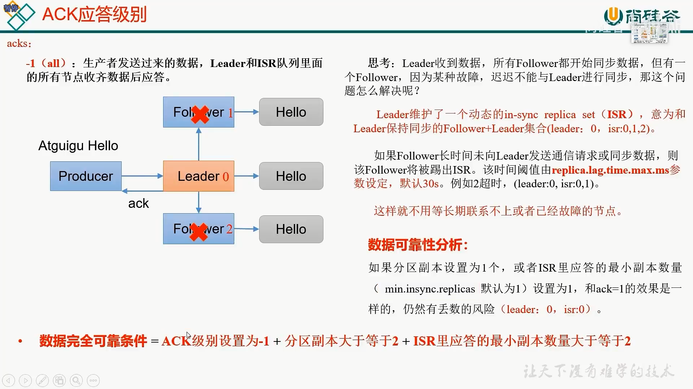


ACKS应答代码

  ```java
     // 设置kafka的acks应答
@Slf4j
public class KafkaProducerTest {
    @Test
    public void testKafkaACKS() throws ExecutionException, InterruptedException {
        Map<String, Object> configs = new HashMap<>();
        // 链接kafka集群
        configs.put(ProducerConfig.BOOTSTRAP_SERVERS_CONFIG, "192.168.35.21:9092, 192.168.35.22:9092");
        // 配置key的序列化
        configs.put(ProducerConfig.KEY_SERIALIZER_CLASS_CONFIG, StringSerializer.class.getName());
        // 配置value的序列化
        configs.put(ProducerConfig.VALUE_SERIALIZER_CLASS_CONFIG, StringSerializer.class.getName());
        // 配置kafka的acks
        configs.put(ProducerConfig.ACKS_CONFIG, "1");
        //重试次数
        configs.put(ProducerConfig.RETRIES_CONFIG, 0);
        // 创建一个kafka对象
        KafkaProducer<String, String> producer = new KafkaProducer<>(configs);
        // String topic 发送的topic， Integer partition 发送的分区，
        // Long timestamp 发送的时间戳， Object key Object value
        ProducerRecord<String, String> record = new ProducerRecord<>("test-topic", "222222", "first-value");
        // 发送数据   record 是消息体，  Callback callback  回调函数
        // producer.send(record);
        producer.send(record, (metadata, exception) -> {
            if (exception == null) {
                log.info("发送完成");
                log.info("数据信息：话题：{}, 分区：{}", metadata.topic(), metadata.partition());
            }
        }).get();
        // 关闭资源
        producer.close();
    }
}
  ```

#### kafka数据的幂等性

kafka的幂等性是通过 <PID,Partition,SeqNumber> 来决定的，PID当kafka重启的时候，会产生新的PID，所以不能完全保证数据不重复

参数配置：enable.idempotence = true 默认为true

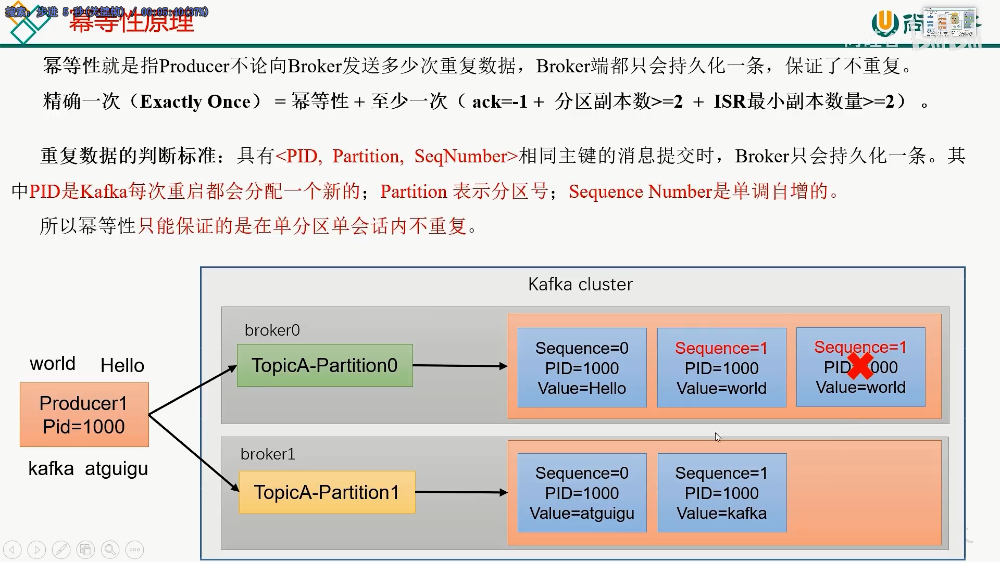

#### kafka事务

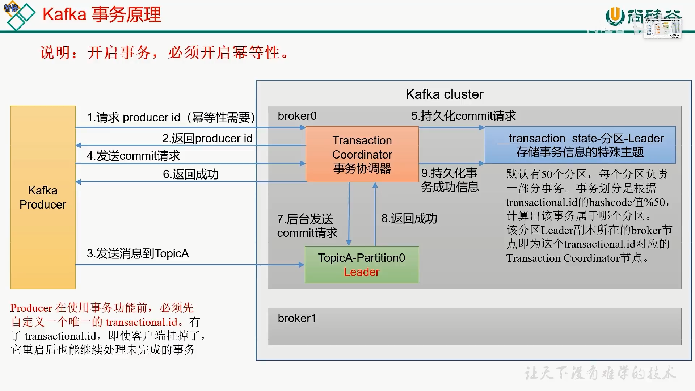

  ```java

@Slf4j
public class KafkaTranactionsTest {

    @Test
    public void kafkaTranactionTest_1() {
        Map<String, Object> configs = new HashMap<>();
        // 链接kafka集群
        configs.put(ProducerConfig.BOOTSTRAP_SERVERS_CONFIG, "192.168.35.21:9092, 192.168.35.22:9092");
        // 配置key的序列化
        configs.put(ProducerConfig.KEY_SERIALIZER_CLASS_CONFIG, StringSerializer.class.getName());
        // 配置value的序列化
        configs.put(ProducerConfig.VALUE_SERIALIZER_CLASS_CONFIG, StringSerializer.class.getName());
        // 创建一个kafka对象
        KafkaProducer<String, String> producer = new KafkaProducer<>(configs);
        // String topic 发送的topic， Integer partition 发送的分区，
        // Long timestamp 发送的时间戳， Object key Object value
        ProducerRecord<String, String> record = new ProducerRecord<>("test-topic", "first-value");
        // 指定事务ID
        configs.put(ProducerConfig.TRANSACTIONAL_ID_CONFIG, "trans_id");
        // 初始化事务
        producer.initTransactions();
        // 开启事务
        producer.beginTransaction();
        try {
            // 发送数据   record 是消息体，  Callback callback  回调函数
            // producer.send(record);
            producer.send(record, (metadata, exception) -> {
                if (exception == null) {
                    log.info("发送完成");
                    log.info("数据信息：话题：{}, 分区：{}", metadata.topic(), metadata.partition());
                }
            });
            // 事务提交
            producer.commitTransaction();
        } catch (Exception ex) {
            // 事务回滚
            producer.abortTransaction();
        } finally {
            // 关闭资源
            producer.close();
        }
    }

}
  ```

#### kafka 数据有序

数据有序可以使用2种：

1. 多分区情况：如果是多分区，那么可以将消息拉到程序中，进行排序，然后消费
2. 单分区情况：
    1. kafka v1.x需要考虑到数据乱序情况，由于在生产者中，默认可以缓存5个请求，当请求1，请求2发送成功，请求3失败，但是请求4成功，那么单分区存在的消息为：1，2，4，请求3丢失，导致消息乱序 那么，可以配置参数
       max.in.flight.requests.per.connection=1，此参数可以控制请求数只能缓存1个。
    2. kafka v1.x+ 如果未开启幂等性，那么需要设置 max.in.flight.requests.per.connection=1
       如果开启了幂等性，那么只需要设置：max.in.flight.requests.per.connection <= 5 即可

具体如下图：
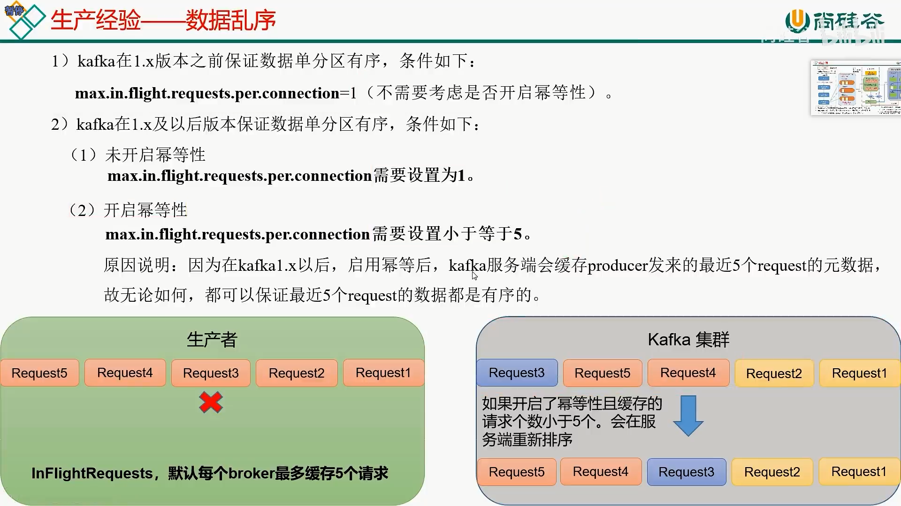

#### kafka 在zookeeper上的

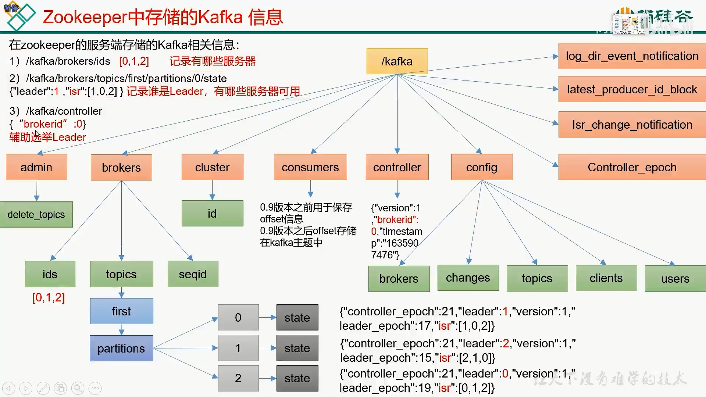

#### kafka Broker工作流程

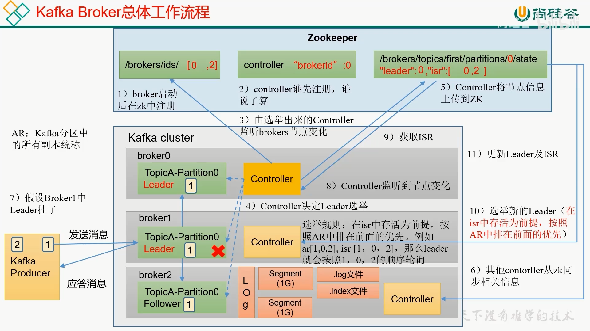

#### kafka的节点服役和退役

1. 节点的服役

   创建一个新的kafka服务器，命名为 kafka-24，ip为 192.168.35.24

       hostnamectl set-hostname kafka-24
       su

   修改kafka中的config/server.properties文件，搜索 broker.id为4

   tip：如果是克隆的节点，那么需要删除kafka中对应的datas目录和logs目录

   启动kafka
   ```shell
      ./bin/kafka-server-start.sh -daemon config/server.properties
     #  查看 原来节点的 话题为 test-topic 的状态
      ./kafka-topics.sh --bootstrap-server 127.0.0.1:9092 --topic test-topic --describe
       
       Topic: test-topic       TopicId: jTV0JFdmSJKC2fPQC3Sodg PartitionCount: 2       ReplicationFactor: 3    Configs: segment.bytes=1073741824
       Topic: test-topic       Partition: 0    Leader: 2       Replicas: 2,3,1 Isr: 1,2,3
       Topic: test-topic       Partition: 1    Leader: 2       Replicas: 3,2,1 Isr: 2,1,3
       # 目前发现 24 节点还没有服役.可查看 Replicas 还只有 1,2,3服务器,还需要加入 4 服务器
       # 创建一个json文件
       vi new-server-join.json
       {
         "topics": [
           # 可添加多个topic
           {"topic":"test-topic"}
         ],
         "version": 1
       }
      # 产生计划:
      # -- broker-list "均衡的节点多个用逗号隔开" 
      ./bin/kafka-reassign-partitions.sh --bootstrap-server 127.0.0.1:9092 --topics-to-move-json-file new-server-join.json --broker-list "1,2,3,4" --generate
   ```    
   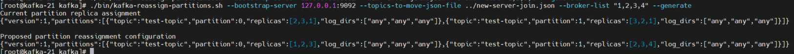
   接下来继续创建一个json文件,new-server-join-config.json,这个json就是上面生成的json串
   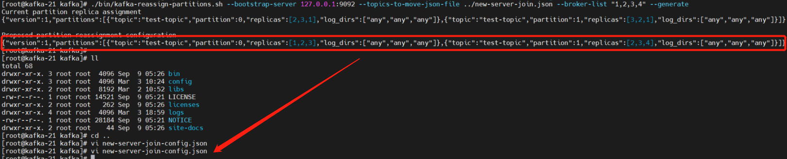
   执行命令:

   ```shell
    ./bin/kafka-reassign-partitions.sh --bootstrap-server 127.0.0.1:9092 --reassignment-json-file new-server-join-config.json --execute
    # 节点服役验证脚本
    ./bin/kafka-reassign-partitions.sh --bootstrap-server 127.0.0.1:9092 --reassignment-json-file ../new-server-join-config.json --verify
    ./bin/kafka-topics.sh --bootstrap-server 127.0.0.1:9092 --topic test-topic --describe
   ```

节点服役执行完成后:
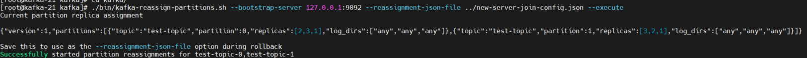
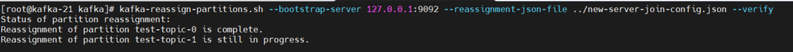
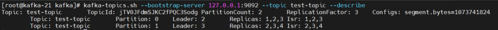

2. 节点的退役

   编译一个json文件,此json文件和节点的服役是一致的

   ```shell
      vi topic-remove.json
   ```
   ```json
       {
         "topics": [
           {"topic":"test-topic"}
         ],
         "version": 1
       }
   ```
   创建执行计划:
    ```shell
      ./bin/kafka-reassign-partitions.sh --bootstrap-server 127.0.0.1:9092 --topics-to-move-json-file ../topic-remove.json --broker-list "1,2,3" --generate
   ```

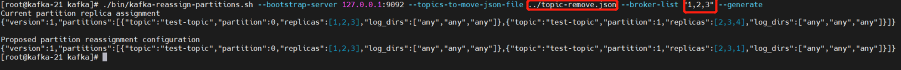
将生成的json放到 topic-remove-json.json文件中,然后指定此文件执行即可

```shell
./bin/kafka-reassign-partitions.sh --bootstrap-server 127.0.0.1:9092 --reassignment-json-file ../topic-remove-json.json --execute
./bin/kafka-reassign-partitions.sh --bootstrap-server 127.0.0.1:9092 --reassignment-json-file ../topic-remove-json.json --verify
./bin/kafka-topics.sh --bootstrap-server 127.0.0.1:9092 --topic test-topic --describe
```

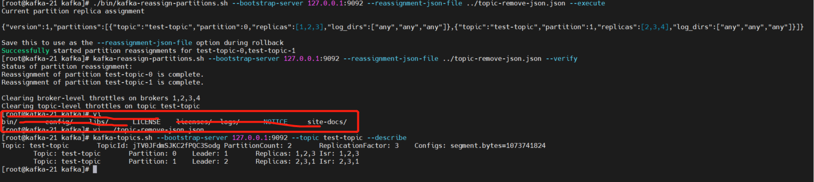

#### kafka 副本

副本可提高数据的可靠性

kafka所有的生产者和消费者都针对的是leader服务器，follower会从leader进行同步数据

Kafka所有的副本叫做AR

AR = ISR +OSR

ISR 为leader保持同步的follower，如果follower长时间没有同步leader，那么此follower会从ISR中被剔除，默认时间30s，可通过 replica.lag.time.max.ms参数设置
当Leader发生故障，会从ISR中选择新的Leader

OSR 为follower与leader副本同步时，延迟过多的副本，即：超过30s未同步leader的

#### Leader选举流程

查看 kafka Broker工作流程

#### follower故障处理

LEO （Log End Offset） 每个副本最后一个offset，LEO其实就是最新的 offset + 1

HW （High Watermark） 所有副本中最小的 LEO

当出现follower挂了的情况，优先在 ISR队列中剔除

ISR 【0 1 2】

Leader

0 1 2 3 4 5 6 7 8

F1

0 1 2 3 4

F2

0 1 2 3 4 5 6

从 以上可以看出，F1的LEO为5，F2的LEO为7，HW为5，当F2出现故障时，优先从ISR中剔除2,接下来F2会删除 【5 6】 数据， 然后从leader中继续同步【5】以后的数据，直到追到其他follower的HW，恢复集群状态

#### Leader故障处理

如果leader发生故障，那么会优先选出leader，选出完成后，所有follower上的数据，都要同步新的leader，如果数据多于新leader，那么follower要删除多于的数据，重新同步leader

#### 手动调整分区

当集群硬盘差距相对较大时，就需要给小的磁盘分配较少的数据，就需要我们手动指定分区分到哪些broker上

   ```shell
    # 创建一个新的topic，名称为：fix-partition
    ./bin/kafka-topics.sh --bootstrap-server 127.0.0.1:9092 --create --partitions 3 --replication-factor 2 --topic fix-partition
    # 查看分区状态
    ./bin/kafka-topics.sh --bootstrap-server 127.0.0.1:9092 --describe --topic fix-partition
   ```

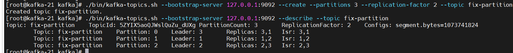

创建副本执行计划命名为：fix-partition-josn.json[可以自定义]，为如下json：[目前搭建的broker为：broker-1，broker-2，broker-3]

   ```json
      {
        "version": 1,
        "partitions": [
          {"topic": "fix-partition", "partition": 0, "replicas": [1,2]},
          {"topic": "fix-partition", "partition": 1, "replicas": [1,2]},
          {"topic": "fix-partition", "partition": 2, "replicas": [1,2]}
        ]
      }
   ```
执行如下命令：
   ```shell
    ./bin/kafka-reassign-partitions.sh --bootstrap-server 127.0.0.1:9092 --reassignment-json-file ../fix-partition-json.json --execute
  ```
验证副本存储计划：
```shell
./bin/kafka-reassign-partitions.sh --bootstrap-server 127.0.0.1:9092 --reassignment-json-file ../fix-partition-json.json --verify
```
执行完成后，如下图：

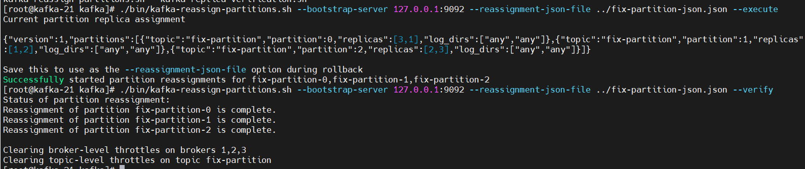

kafka自动分区：

生产环境中要注意：如果设置了此致，当容量超过10%的时候，会自动触发自动负载均衡，所以要注意性能。
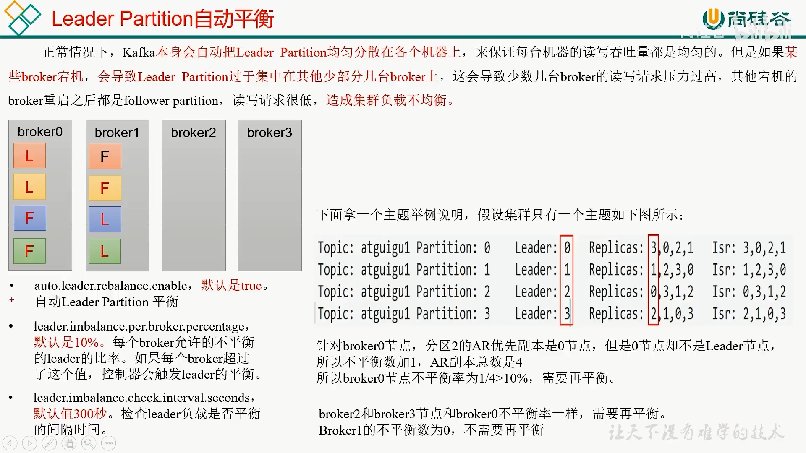

#### kafka的文件存储

   kafka文件存储：
   
   kafka是一个broker中包含了多个topic，而topic又可以分成多个partition，而partition的底层存储是由log文件组成，log文件又分成了多个Segment，
   而Segment由 [.log 日志文件 默认1G， .index 偏移索引文件， .timeindex 时间戳索引文件， 其他文件] 文件组成，index索引文件名是以第一个索引为名称
   
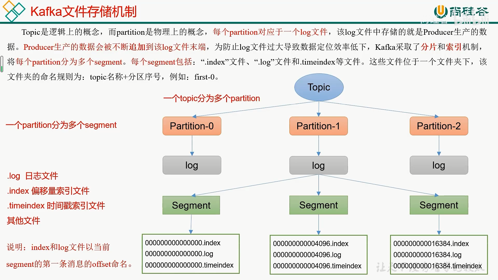


### pulsar


    