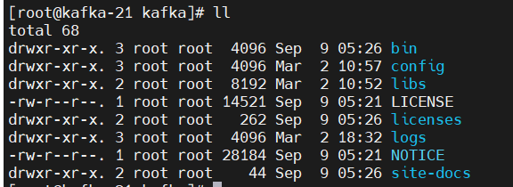
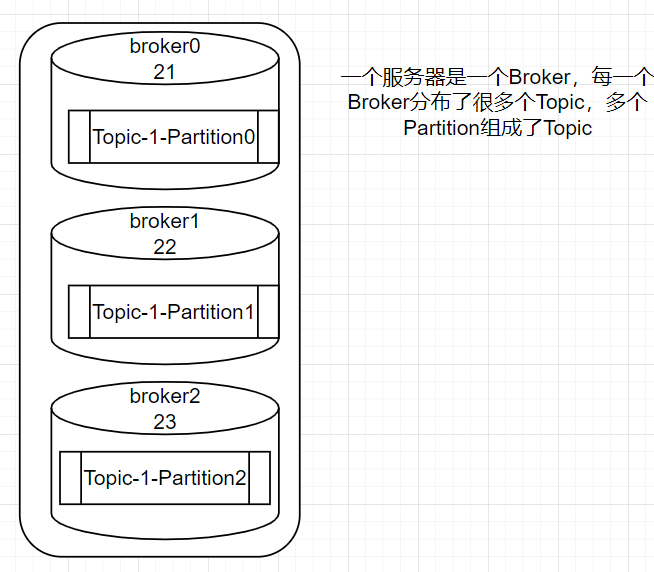

## 消息队列

常见的消息队列，如下：
  1. rabbitmq 
  2. rocketmq
  3. kafka
  4. pulsar

----

### rabbitmq

### rocketmq

### kafka
    
  官方网址： https://kafka.apache.org/

  集群搭建：

  kafka 在 v2.8.0 后将zookeeper替换掉，使用独立的集群管理工具。
  目前搭建采用： zookeeper + kafka 进行搭建

  准备工作：

  系统： Centos7 jdk1.8

  ip: 192.168.35.21 - 23

  命名主机：hostnamectl set-hostname kafka-[21,22,23]

  zookeeper 搭建：
  
  搭建目录 /opt/zookeeper   /opt/kafka

  zookeeper目录结构：
  
  
  
  1. bin: 运行命令
  2. conf: 配置文件
  3. datas: 自己创建的数据文件夹
  4. docs: 文档
  5. lib: zookeeper的jar文件
  6. logs: 日志文件
  
  进入conf文件夹，复制zoo_sample.cfg为zoo.cfg，并编辑zoo.cfg文件如下。

    dataDir=/opt/zookeeper/zookeeper/datas
    server.1=192.168.35.21:2888:3888
    server.2=192.168.35.22:2888:3888
    server.3=192.168.35.23:2888:3888
    dataDir 需要修改对应的数据存储目录，目前是临时文件目录，需要进行修改
    其中2888是服务端口，3888是选举端口
    三台机器都要进行相应的配置

  
  
  在zookeeper根目录下创建datas目录。

    mkdir datas
  
  在此datas下创建 myid 文件，并追加对应的编号
  
    echo 1 > datas/myid    192.168.35.21
    echo 2 > datas/myid    192.168.35.22
    echo 3 > datas/myid    192.168.35.23

  

  启动zookeeper
  
  进入zookeeper的bin目录下，三台机器均执行如下命令：
  
    ./zkServer.sh start

  

  启动完成
  
  查看zookeeper状态：
  
  
    

  搭建kafka

  kafka目录结构

  

  1. bin 启动目录
  2. config 配置文件
  3. libs kafka的三方jar文件
  4. logs kafka日志文件

  kafka配置文件，conf/server.properties
    
    broker.id=1
    zookeeper.connect=192.168.35.21:2181,192.168.35.22:2181,192.168.35.23:2181/kafka
    log.dirs=/opt/kafka/kafka/logs
    broker.id=1 每台服务器不一样  【21 为 1  22 为2  23 为3】
    zookeeper.connect zookeeper的链接地址
    log.dirs 日志文件存储位置

  
  
  启动zookeeper
    
    启动命令如下：
    ./kafka-server-start.sh -daemon ../config/server.properties
  
  
  
  查看kafka中的topic

    kafka-topics.sh --bootstrap-server 127.0.0.1:9092 --list

---
  
  kafka 原生代码
    
   ```xml
      <dependency>
            <groupId>org.apache.kafka</groupId>
            <artifactId>kafka-clients</artifactId>
            <version>${kafka-version}</version>
        </dependency>
   ```

  ```java
    // 异步发送
    @Slf4j
    public class KafkaProducerTest {
    
      @Test
      public void testKafkaProducer_1() {
        Map<String, Object> configs = new HashMap<>();
        // 链接kafka集群
        configs.put(ProducerConfig.BOOTSTRAP_SERVERS_CONFIG, "192.168.35.21:9092, 192.168.35.22:9092");
        // 配置key的序列化
        configs.put(ProducerConfig.KEY_SERIALIZER_CLASS_CONFIG, StringSerializer.class.getName());
        // 配置value的序列化
        configs.put(ProducerConfig.VALUE_SERIALIZER_CLASS_CONFIG, StringSerializer.class.getName());
        // 创建一个kafka对象
        KafkaProducer<String, String> producer = new KafkaProducer<>(configs);
        // String topic 发送的topic， Integer partition 发送的分区，
        // Long timestamp 发送的时间戳， Object key Object value
        ProducerRecord<String, String> record = new ProducerRecord<>("test-topic", "first-value");
        // 发送数据   record 是消息体，  Callback callback  回调函数
        // producer.send(record);
        producer.send(record, (metadata, exception) -> {
          if (exception == null) {
            log.info("发送完成");
            log.info("数据信息：话题：{}, 分区：{}", metadata.topic(), metadata.partition());
          }
        });
        // 关闭资源
        producer.close();
      }

      // 同步发送
      @Test
      public void testKafkaProducer_sync() throws ExecutionException, InterruptedException {
        Map<String, Object> configs = new HashMap<>();
        // 链接kafka集群
        configs.put(ProducerConfig.BOOTSTRAP_SERVERS_CONFIG, "192.168.35.21:9092, 192.168.35.22:9092");
        // 配置key的序列化
        configs.put(ProducerConfig.KEY_SERIALIZER_CLASS_CONFIG, StringSerializer.class.getName());
        // 配置value的序列化
        configs.put(ProducerConfig.VALUE_SERIALIZER_CLASS_CONFIG, StringSerializer.class.getName());
        // 创建一个kafka对象
        KafkaProducer<String, String> producer = new KafkaProducer<>(configs);
        // String topic 发送的topic， Integer partition 发送的分区，
        // Long timestamp 发送的时间戳， Object key Object value
        ProducerRecord<String, String> record = new ProducerRecord<>("test-topic", "first-value");
        // 发送数据   record 是消息体，  Callback callback  回调函数
        // producer.send(record);
        producer.send(record, (metadata, exception) -> {
          if (exception == null) {
            log.info("发送完成");
            log.info("数据信息：话题：{}, 分区：{}", metadata.topic(), metadata.partition());
          }
          // 多了个get
        }).get();
        // 关闭资源
        producer.close();
      }
    }
  ```
  

  kafka 代码整合 springboot
  
  kafka 原理图
    
  kafka的broker、topic及partition
  
  
  生产者发送数据流程：
  
  
  kafka分区原理：
  
  kafka默认分区规则： DefaultPartition类完成

  1. 指定了分区，那么按着指定的分区进行分
  2. 没有指定分区，按key的hash取模进行分区
  3. 既没有指定分区且没有指定key，那么按照黏性进行分区，即：batch满了后，分到一个区

  分区重构函数：
  
  修改分区命令：
  ```shell
    # 只能增，不能减小
    kafka-topics.sh --bootstrap-server 127.0.0.1:9092 --topic test-topic --alter --partitions 2
    kafka-topics.sh --bootstrap-server 127.0.0.1:9092 --describe --topic test-topic
  ```

  ```java
    // 指定了 partition分区 
    public ProducerRecord(String topic, Integer partition, K key, V value, Iterable<Header> headers) {}
    // 未指定分区
    // 根据Key的hash和topic的partition数取模获取到partition的值
    public ProducerRecord(String topic, K key, V value) {}
    // 黏性分区，随机选一个分区，然后 batch.size的大小或linger.ms时间到了，那么刷新此分区，等再次有消息时，再次随机选择一个partition分区
    public ProducerRecord(String topic, V value) {}
  ```  
  自定义分区
  
  ```java
    
    // 实现Partitioner接口，并且实现partition，当党报future的key时，分区到 0 ，否则分区到1
    // 如果分区的区不存在，那么消息会一直尝试发送
    @Slf4j
    public class KafkaCustomPartition implements Partitioner {
    
      @Override
      public int partition(String topic, Object key, byte[] keyBytes, Object value, byte[] valueBytes, Cluster cluster) {
        if (Objects.isNull(key)) {
          throw new NullPointerException("key不能为空");
        }
        // 将分区分成   【0： 包含 future， 1：不包含future】
        if (StringUtils.contains(key.toString(), "future")) {
          return 0;
        }
        return 1;
      }
    
      @Override
      public void close() {
    
      }
    
      @Override
      public void configure(Map<String, ?> configs) {
    
      }
    
      @Test
      public void testKafkaPartitionProducer_sync() throws ExecutionException, InterruptedException {
        Map<String, Object> configs = new HashMap<>();
        // 链接kafka集群
        configs.put(ProducerConfig.BOOTSTRAP_SERVERS_CONFIG, "192.168.35.21:9092, 192.168.35.22:9092");
        // 配置key的序列化
        configs.put(ProducerConfig.KEY_SERIALIZER_CLASS_CONFIG, StringSerializer.class.getName());
        // 配置value的序列化
        configs.put(ProducerConfig.VALUE_SERIALIZER_CLASS_CONFIG, StringSerializer.class.getName());
        // 配置分区
        configs.put(ProducerConfig.PARTITIONER_CLASS_CONFIG, KafkaCustomPartition.class.getName());
        // 创建一个kafka对象
        KafkaProducer<String, String> producer = new KafkaProducer<>(configs);
        // String topic 发送的topic， Integer partition 发送的分区，
        // Long timestamp 发送的时间戳， Object key Object value
        ProducerRecord<String, String> record = new ProducerRecord<>("test-topic", "future-ttt", "first-value");
        // 发送数据   record 是消息体，  Callback callback  回调函数
        // producer.send(record);
        producer.send(record, (metadata, exception) -> {
          if (exception == null) {
            log.info("发送完成");
            log.info("数据信息：话题：{}, 分区：{}", metadata.topic(), metadata.partition());
          }
        }).get();
        // 关闭资源
        producer.close();
      }
    }
    
  ```
  生产者优化：
  


### pulsar


    