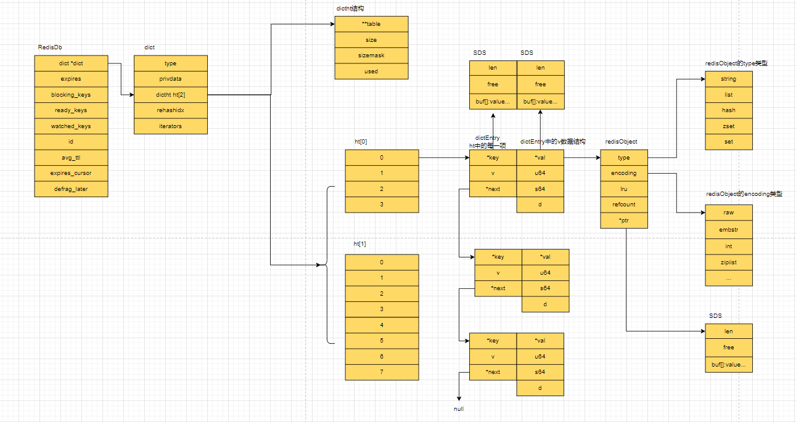
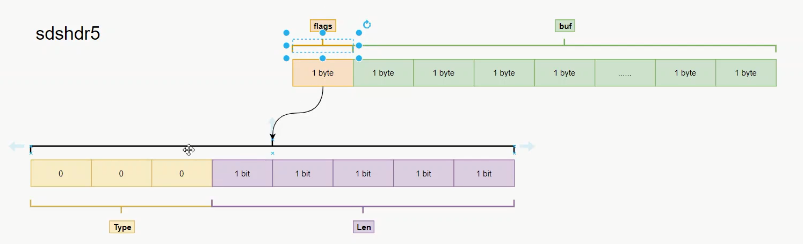

## redis底层源码

redis 源码地址： https://github.com/redis/redis

可以使用CLion进行项目的搭建

1. 高速的存储介质
2. 优良的底层数据结构
3. 高效的网络IO
4. 高效的线程模型

redis的key string源码：

### RedisDB

redis一共16个库，从0-15.

```c
typedef struct redisDb {
    dict *dict; // 一个hash表 类似于java中的hashMap，所有键值对存储位置
    dict *expires;  // 存储过期时间
    dict *blocking_keys; // 阻塞的api
    dict *ready_keys; // 阻塞的时候做的准备keys
    dict *watched_keys; // 事务相关命令
    int id;
    long long avg_ttl;
    unsigned long expires_cursor;
    list *defrag_later;
} redisDb;

typedef struct dict {
    dictType *type;   // 字典类型
    void *privdata;
    dictht ht[2];  // 字典的hashtable , 2个hashtable，第二个hashtable比第一个hashtable多一倍
    long rehashidx; // rehash的索引
    int16_t pauserehash; 
} dict;


typedef struct dictType {
    uint64_t (*hashFunction) (const void *key);
    void *(*keyDup)(void *privdata, const void *key);
    void *(*valDup)(void *privdata, const void *obj);
    int (*keyCompare)(void *privdata, const void *key1, const void *key2);
    void (*keyDestructor)(void *privdata, void *key);
    void (*valDestructor)(void *privdata, void *obj);
    int (*expandAllowed)(size_t moreMem, double usedRatio);
} dictType;

// 2个hashtable，第二个比第一个多一倍，用于渐进式rehash，防止高并发时，搬迁速度慢。
// 2种场景，一个主动，一个被动，上面的为主动，被动有一个事件循环去监听，把老的搬迁到新的hashtable中
typedef struct dictht {
    dictEntry **table; // 就是一个hashtable
    unsigned long size; // hashtable的size
    unsigned long sizemask; // size - 1
    unsigned long used; // hashtable有多少个元素
} dictht;

typedef struct dictEntry {
    void *key; // redis中的key值
    union {  
        void *val; // redis中的value值，其指向了RedisObject
        uint64_t u64;
        int64_t s64;
        double d;
    } v;
    struct dictEntry *next;
} dictEntry;

typedef struct redisObject {
    unsigned type:4; // 记录value的类型  0.5byte   4个bit
    unsigned encoding:4;  // value的编码形式  0.5byte  4个bit
    unsigned lru:LRU_BITS; // 内存淘汰算法 3byte
    int refcount; // 引用计数器法淘汰 4byte
    void *ptr; // 指向的内存区域，通过此指针，可以找到对应的value  8byte
} robj;
```



### SDS

redis底层采用了SDS【simple dynamic string】 简单动态字符串

为什么不采用C语言的字符串呢，是因为C语言中将\0设置为一个字符串的末尾，这样其他语言设置key的时候，容易出现问题。

```text
SDS：
    int len: 7  2  记录长度，头部数据，即：hdr
    char[] buf = "123\0dsdd" 
在redis6.0版本中，采用了多个sds来节省空间：
其中包含了 【sdshdr5 2^5-1，sdshdr8 2^8-1， sdshdr16 2^16-1  sdshdr32 2^32-1】
```

SDSHDR5：

一个char类型为1个byte，如下图： 前3个bit位来标识Type，后5个bit位表示长度



除了SDSHDR5以外，在其他的sds中，分别加入了一个属性：uint_t alloc，此属性为剩余的可扩充空间，如:

当我们申请一个字符串为 char[] c = '345' ，当前申请空间为 16个长度，那么占用了3个，还剩13个长度，即：alloc为13，目的是因为数组创建之后，不可更改
为了不反复的申请空间和拷贝数据，所以增加了alloc属性。


### redis 的 底层 int和string的编码

#### redis 数值编码

如果是设置的值为数值，那么底层在redisObject中，存储的*ptr直接是此数值，而不是地址的值，这样可以直接查询到对应的结果，不用再去寻找地址了。

如果设置的数字类型的value值，那么redis的底层会去判断此值是否小于20，小于20是因为最大的long类型是2^63 - 1，为19位，但是负数为20位，所以有可能
转换成数字，如果是转换成数字，那么可以直接存储到*ptr地址值上，就不需要再次申请空间了。

```shell
> set intKey 100
> object encoding intKey
> "int"
```

#### redis的string编码

```text
cpu 一次性取数据，都是 64byte
也就是 4个int。
redisObject对象一共占用了16byte，此时还会剩余48byte。
而48byte位于 sdshdr8 中，即： 2^5 - 2^8 - 1 之间，查看此源码
struct sdshdr8 {
    uint8_t len;     // 1 byte
    uint8_t alloc;   // 1 byte
    unsigned char flags;   // 1 byte
    char buf[];     // \0 格外的 1个 byte，C语言中\0表示字符串结束
}
它需要格外的4个byte占用，剩余44个字节，所以当字符串小于 44个时，会使用embstr进行编码存储。可以减少内存的io。

面试题：
for (int i = 0; i < 100; i++) {}和for (int i = 0; i < 100; i+=16) {}哪个更快，其实差不多快，因为每次取出都是16个int，而在cpu中执行的速度是很快的
```

#### redis的list底层源码


