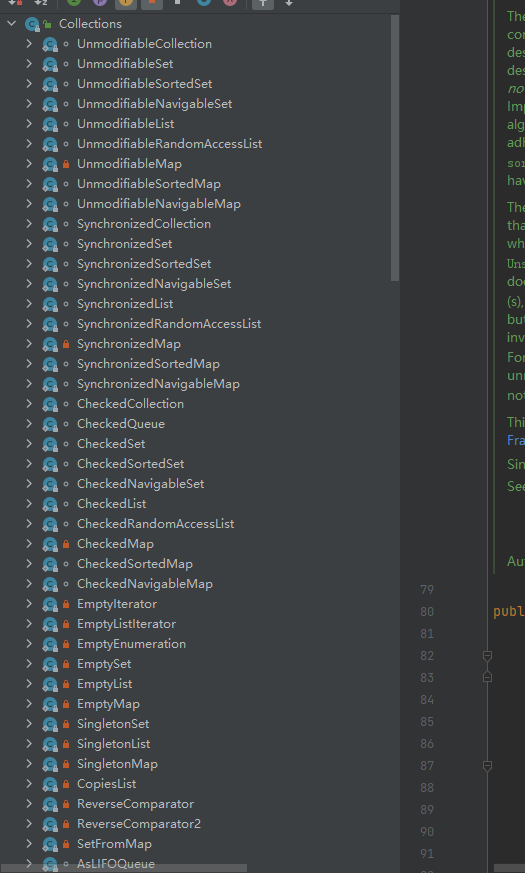

## Java-Collection

java的集合接口Collection

Collection继承了Iterable迭代器

```java
    // Iterable迭代器是一个接口，其中有三个方法 
    Iterator<T> iterator();
    default void forEach(Consumer<? super T> action)
    default Spliterator<T> spliterator()
```
迭代器示例如下：
```java
/**
 * 自定义迭代器，实现 Iterable中的iterator()方法
 * 创建一个Iterator对象，实现hasNext和next方法。hasNext判断是否有下一个，next是下一个
 * @author: zhpj
 * @date: 2022-03-04 13:33
 */
public class CustomIterable implements Iterable<Integer>{

    private int[] nums ;

    private int point = -1;

    public CustomIterable(int[] nums) {
        if (Objects.isNull(nums)) {
            throw new NullPointerException("nums不能为空");
        }
        this.nums = nums;
    }

    @Override
    public Iterator<Integer> iterator() {
        return new Iterator<Integer>() {
            @Override
            public boolean hasNext() {
                return point < nums.length - 1;
            }

            @Override
            public Integer next() {
                point++;
                return nums[point];
            }
        };
    }

    @Test
    public void testCustomIterable() {
        CustomIterable iterable = new CustomIterable(new int[]{1, 2, 3, 4, 7});
        Iterator<Integer> iterator = iterable.iterator();
        while (iterator.hasNext()) {
            Integer next = iterator.next();
            log.info("获取到的数据为：{}", next);
        }
    }

}
```

### Collection API

```java
public interface Collection<E> extends Iterable<E> {
    
    // 集合的大小
    int size();
    // 是否为空
    boolean isEmpty();
    // 是否包含
    boolean contains(Object o);
    // 迭代器
    Iterator<E> iterator();
    // 转换成数组
    Object[] toArray();
    <T> T[] toArray(T[] a);
    // 添加元素
    boolean add(E e);
    // 删除元素
    boolean remove(Object o);
    // 是否包含所有的元素
    boolean containsAll(Collection<?> c);
    // 添加所有集合到当前对象中
    boolean addAll(Collection<? extends E> c);
    // 在当前对象中删除传递的集合
    boolean removeAll(Collection<?> c);
    // 删除 过滤中的对象
    default boolean removeIf(Predicate<? super E> filter){}
    // 将存在于集合A中但不存在于集合B中的元素移除 ， 如果集合A的大小发生了改变，返回true，即使两个集合完全没有交集，也会返回true。
    boolean retainAll(Collection<?> c);
    // 清空所在对象
    void clear();
}
```
#### Collection 接口继承的类和相关接口

主要看红框中的相关数据

当然也有很多子接口和孙子接口
```java

// Collection,
// Set, 
// ArrayList,
// LinkedList, 
// Vector, 
// Arrays.asList(Object[]), 
// Collections.nCopies(int, Object), 
// Collections.EMPTY_LIST, 
// AbstractList, 
// AbstractSequentialList
```


### Collections为Collection的帮助类

Collections中的内部类：

主要分为以下几个部分：

1. UnmodifiableXxxxx 不可修改类
2. SynchronizedXxxxx 同步类
3. CheckedXxxxx 
4. EmptyXxxx 




```java
/** UnmodifiableCollection.class
 *此类属于Collections的内部类，主要用于不可修改的集合
 * 通过构造方法创建对象，内部维护了独立的集合对象，不可以传递空对象，如果传递空对象，那么将会抛出空指针异常
 * 如果调用了相关的查询方法，那么会调用内部对象的相关查询方法完成查询
 * 如果是修改相关的方法，那么会抛出 UnsupportedOperationException() 异常
 */
class UnmodifiableCollection<E> implements Collection<E>, Serializable {
    private static final long serialVersionUID = 1820017752578914078L;

    final Collection<? extends E> c;

    UnmodifiableCollection(Collection<? extends E> c) {
        if (c==null)
            throw new NullPointerException();
        this.c = c;
    }
    // 查询方法直接调用传递过来的 对象的方法
    public int size()                   {return c.size();}
    public boolean isEmpty()            {return c.isEmpty();}

    public Iterator<E> iterator() {
        return new Iterator<E>() {
            private final Iterator<? extends E> i = c.iterator();

            public boolean hasNext() {return i.hasNext();}
            public E next()          {return i.next();}
            public void remove() {
                throw new UnsupportedOperationException();
            }
            @Override
            public void forEachRemaining(Consumer<? super E> action) {
                // Use backing collection version
                i.forEachRemaining(action);
            }
        };
    }
    // 操作集合，直接抛出 未提供操作异常
    public boolean add(E e) {
        throw new UnsupportedOperationException();
    }
    public boolean remove(Object o) {
        throw new UnsupportedOperationException();
    }
}
// ex
@Slf4j
public class TestCollections {

    @Test
    public void testUnmodifiableCollection() {
        ArrayList<String> list = new ArrayList<>();
        list.add("1");
        list.add("2");
        list.add("7");
        List<String> unmodifiableList = Collections.unmodifiableList(list);
        // 获取值，那么不会抛出异常
        String s = unmodifiableList.get(0);
        log.info("获取到的值：{}", s);
        // 修改值的时候，抛出异常 UnsupportedOperationException
        unmodifiableList.set(0, "newstring");
    }

}

```


同步集合，位于Collections中，带有SynchronizedXxxx的类，都是线程安全的，查看底层源码，均包含了 synchronized关键字，而此关键字处于同步块，而
同步的锁是定义了一个Object成员变量。
```java
@Slf4j
public class TestCollections {

    @Test
    public void testSynchronizedCollection() throws InterruptedException {
        ArrayList<String> list = new ArrayList<>();
        list.add("1");
        list.add("3");
        list.add("4");
        List<String> synchronizedList = Collections.synchronizedList(list);
        for (int i = 0; i < 100; i++) {
            add(synchronizedList, i);
        }
        TimeUnit.SECONDS.sleep(5);
        log.info("获取到的同步值为：{}", synchronizedList);
    }

    public void add(List<String> synchronizedList, int num) {
        new Thread(() -> {
            synchronizedList.add("newS-" + num);
        }).start();
    }
}
```
Collections.CheckedXxxx 用于返回一个类型安全的视图。如果我们未加泛型，后期需要添加另一种类型，那么可以使用此方法：

比如：

```java
@Slf4j
public class TestCollections {

    @Test
    public void testCheckedCollection() {
        // 现在可以添加任何类型
        List list = new ArrayList<>();
        list.add("1s");
        list.add(1);
        list.add("3");
        list.add("5");
        // 当调用此方法，返回了一个集合，那么此后添加元素必须是 Integer类型，否则报错
        List checkedList = Collections.checkedList(list, Integer.class);
        // 会报错，因为不是Integer类型
        checkedList.add("2c");
        log.info("{}", checkedList);
    }
}

```

Collections.EmptyXxxx 方法,返回一个空集合，没有任何元素，也不允许对此集合进行增删改查操作，但是此对象不为null

```java
@Slf4j
public class TestCollections {

    @Test
    public void testEmptyCollection() {
        List<String> list = Collections.emptyList();
        log.info("{}", list);
    }
}
```

Collections.SingletonXxxx 用于返回一个元素的对象，注意不是**单例对象**，如果继续向里面添加数据，那么会报错【UnsupportedOperationException异常】

```java
@Slf4j
public class TestCollections {

    @Test
    public void testSingletonXxx() {
        List<String> list = Collections.singletonList("123");
        log.info("{}", list);
    }
}
```


